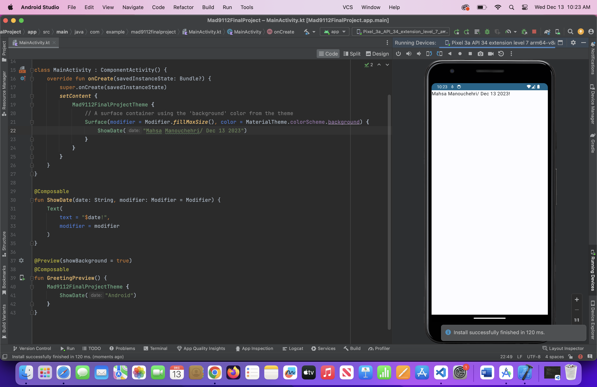
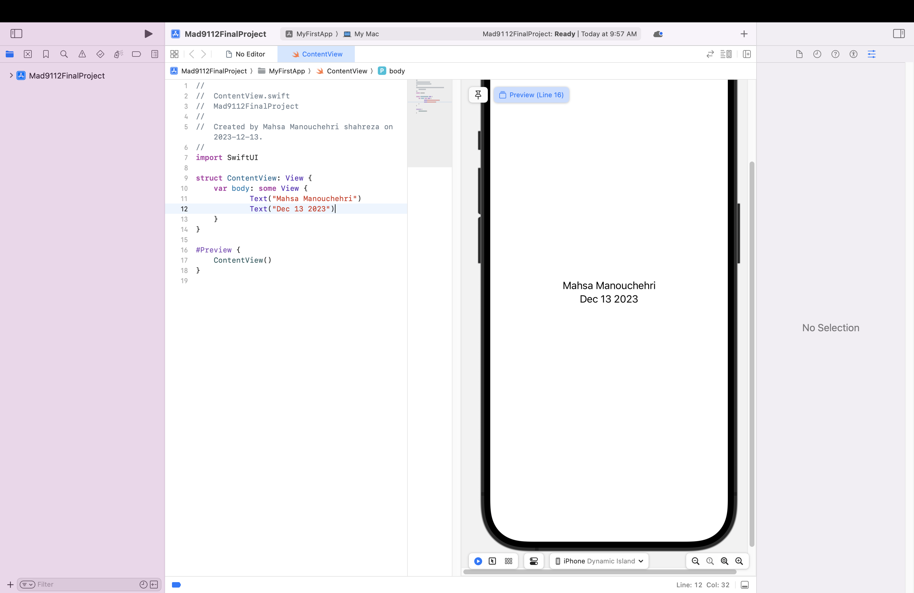
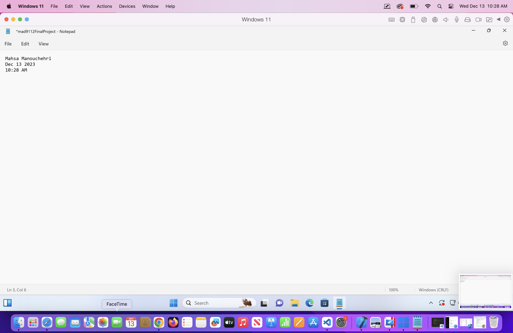

<<<<<<< HEAD
# Mahasa_Manouchehri_FinalProject

## step1
```
function getDaysUntilChristmas() {
  const today = new Date();
  let christmas = new Date(today.getFullYear(), 11, 25); // Christmas is on December 25th
  let oneDay = 1000 * 60 * 60 * 24; // Milliseconds in a day
  let daysUntilChristmas = Math.ceil((christmas - today) / oneDay);
​
  return daysUntilChristmas;
}
​
console.log("Days until Christmas: " + getDaysUntilChristmas() + " days");
```






​
=======
# Mad9112_FinalProject
>>>>>>> 9dd5856c4d587da66a0fdd8aec01150a2b9a8981
